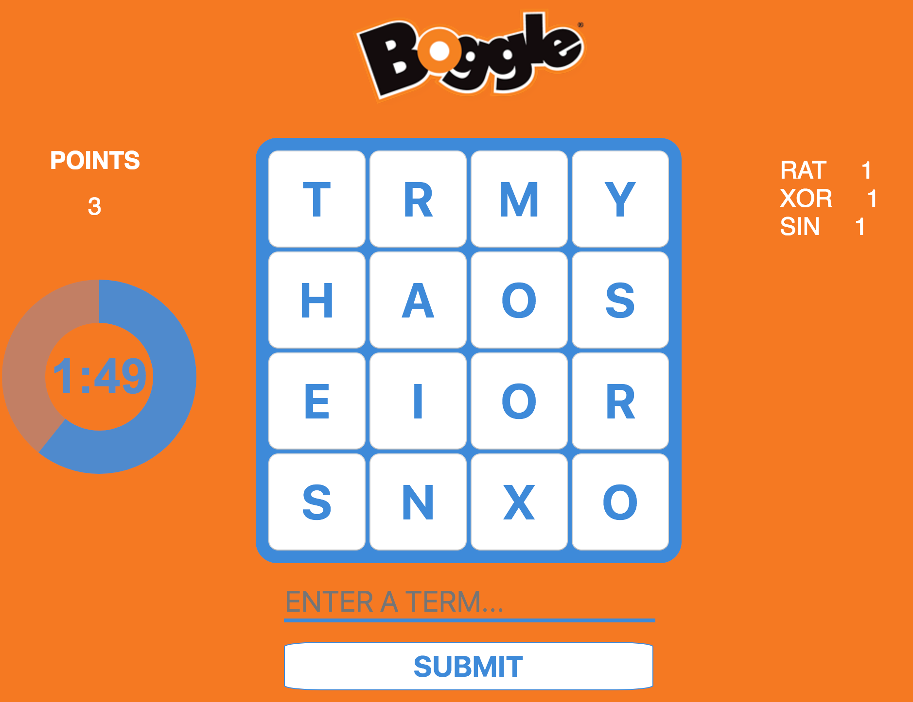

# Boggle Game
--- still working on it ----
 
Boggle is played with a tray of 16 letter dice. Every time when you refresh a page computer will randomly generate grid of letters.  
After they have settled into the grid, a three-minute timer is started and all players simultaneously begin the main phase of play.  
Player searches for words that can be constructed from the letters of sequentially adjacent cubes, where "adjacent" cubes are those horizontally, vertically, and diagonally neighboring. Words must be at least three letters long, may include singular and plural (or other derived forms) separately, but may not use the same letter cube more than once per word. Each player records all the words he or she finds by writing on a private sheet of paper. After three minutes have elapsed, all players must immediately stop writing and the game enters the scoring phase.
  

 

### Built With
---
* [React](https://reactjs.org/)
* [Node] (https://nodejs.org/en/)
* [Express] (https://expressjs.com/)

### Author
---
* **Jelena Gruica** - [Github](https://github.com/jgruica)

### License
---
This project is licensed under the MIT License - see the [LICENSE.md](LICENSE.md) file for details